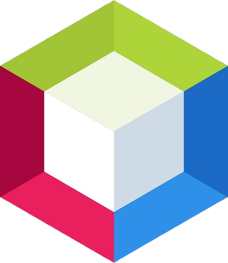

# 👋 Olá, meu nome é Éverton!

## Bem-vindo ao meu perfil do GitHub 

🎓 Estou começando minha jornada desde 2024 e então atuo com desenvolvimento de sistemas.
Estou cursando como Técnico de Desenvolvimento de Sistemas.

💼 Atualmente, estou apredendo programação no Senac-RS, onde aprendo disciplinas como lógica de programação, front-end, back-end e banco de dados.

🚀 Tenho experiência com diversas linguagens e tecnologias (`Java`, `Python`, `JavaScript`, `TypeScript`, `PHP`, `SQL`, entre outras) e estou sempre buscando novos desafios que unam **tecnologia, inovação e educação**.

🧠 Me interesso por tendências tecnológicas, com foco em jogos, Internet das Coisas (IoT) e soluções em computação em nuvem.

🎮 Apaixonado por jogos, e sempre concentrado ouvindo música🎵.

## 💻 Linguagens de programação

  
  
  
  
  

## 🛢️ Bancos de dados

  
  

## 🧰 Tecnologias e ferramentas

  
  
  

## 📬 Onde me encontrar

👉 Curte trocar ideias sobre tecnologia, projetos, ensino ou até relembrar clássicos dos games? 😄 Só chamar!

  
  
    

